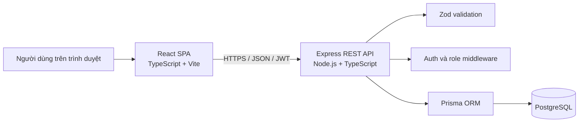
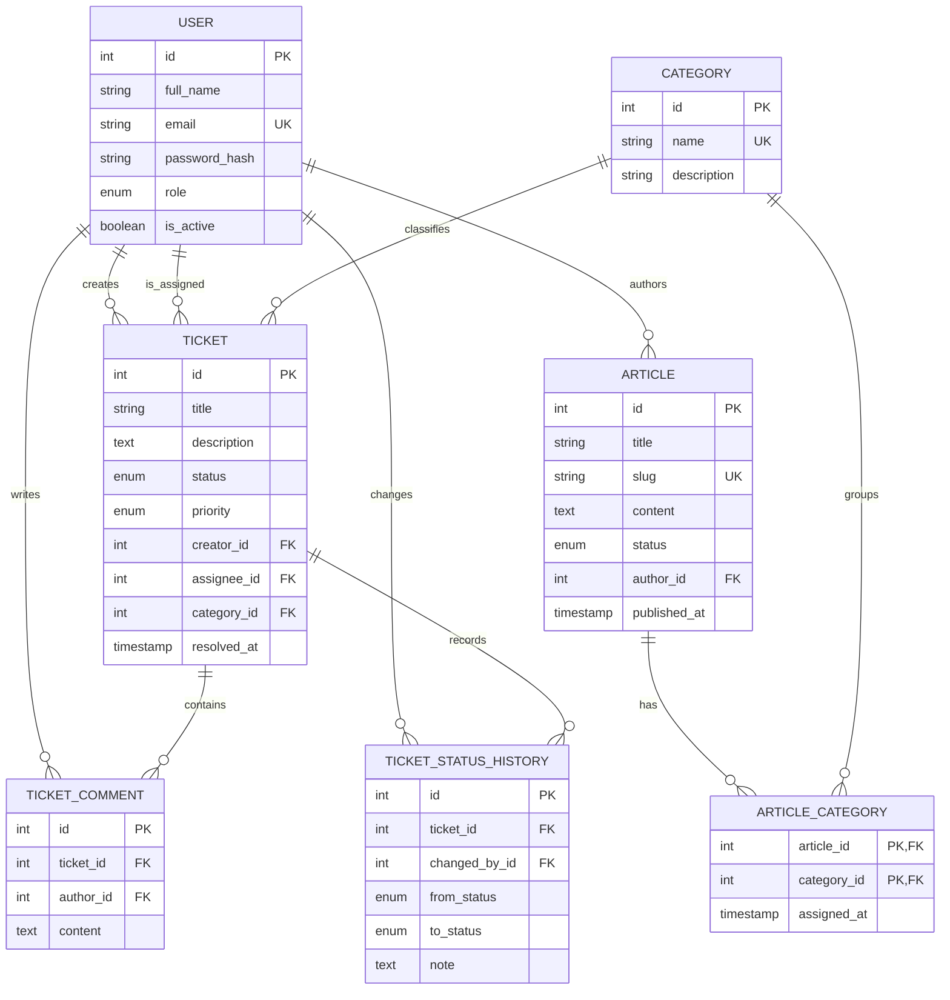

# Kiến trúc hệ thống

## 1. Tổng quan

Internal Helpdesk được xây dựng theo kiến trúc client-server ba lớp. React chịu
trách nhiệm giao diện; Express cung cấp REST API và thực thi quy tắc nghiệp vụ;
Prisma truy cập PostgreSQL.

Frontend chỉ gọi API qua biến `VITE_API_URL`. Backend chỉ cho phép origin được
khai báo trong `CLIENT_URL`, kiểm tra JWT ở các route bảo vệ và không trả
`passwordHash` về client.

## 2. Các module

| Module | Trách nhiệm |
| --- | --- |
| Authentication | Đăng nhập, ký/xác thực JWT, lấy hồ sơ hiện tại |
| Category | Danh mục dùng chung cho ticket và bài viết |
| Ticket | Tạo, lọc, phân trang, xem và cập nhật yêu cầu |
| Comment | Trao đổi giữa người gửi và bộ phận hỗ trợ |
| Status history | Lưu dấu vết mọi lần thay đổi trạng thái |
| Dashboard | Tổng hợp số lượng ticket theo phạm vi quyền |
| Knowledge Base | Tìm kiếm, đọc và quản lý bài hướng dẫn |

## 3. Mô hình dữ liệu

### Lý do thiết kế

- `ArticleCategory` chuẩn hóa quan hệ nhiều-nhiều, tránh lưu danh sách category
  trong một cột và giữ dữ liệu ở dạng nguyên tử.
- `TicketStatusHistory` tách lịch sử khỏi trạng thái hiện tại để truy vấn nhanh
  nhưng vẫn audit được toàn bộ quá trình.
- `resolvedAt` là dữ liệu nghiệp vụ có ý nghĩa đo thời gian xử lý, không thay thế
  `updatedAt`.
- Ticket và bài viết không có API xóa trong MVP. Ticket dùng `CLOSED`, bài viết
  dùng `ARCHIVED` để không mất dấu vết.
- Index được đặt trên khóa ngoại và các tổ hợp thường lọc như status/priority.

## 4. Phân quyền

| Chức năng | Employee | Admin |
| --- | :---: | :---: |
| Đăng nhập, xem hồ sơ | Có | Có |
| Tạo ticket | Có | Có |
| Xem ticket | Chỉ ticket của mình | Tất cả |
| Bình luận ticket | Chỉ ticket của mình | Tất cả |
| Cập nhật status/priority/assignee | Không | Có |
| Đọc bài published | Có | Có |
| Xem draft/archived | Không | Có |
| Tạo và sửa bài viết | Không | Có |
| Tạo category | Không | Có |

Việc kiểm tra quyền được thực hiện ở backend; ẩn nút trên frontend chỉ là lớp UX,
không được xem là biện pháp bảo mật.

## 5. Luồng authentication

1. Client gửi email và password tới `POST /api/auth/login`.
2. Backend tìm user active và so sánh password bằng bcrypt.
3. Backend ký JWT chứa user id và role.
4. Client gửi token trong header `Authorization: Bearer <token>`.
5. Middleware xác thực chữ ký, sau đó đọc lại user từ database để dùng role và
   trạng thái active hiện tại.
6. Role middleware hoặc controller áp dụng quyền trên tài nguyên cụ thể.

## 6. Ranh giới MVP

Hệ thống là monolith có module, phù hợp quy mô dự án thực tập và có thể triển khai
độc lập. Microservice, cache, queue, object storage và WebSocket chưa cần thiết ở
quy mô này. Khi có người dùng thực, ưu tiên tiếp theo là refresh token/cookie an
toàn, reset password, attachment storage, notification và automated E2E tests.
